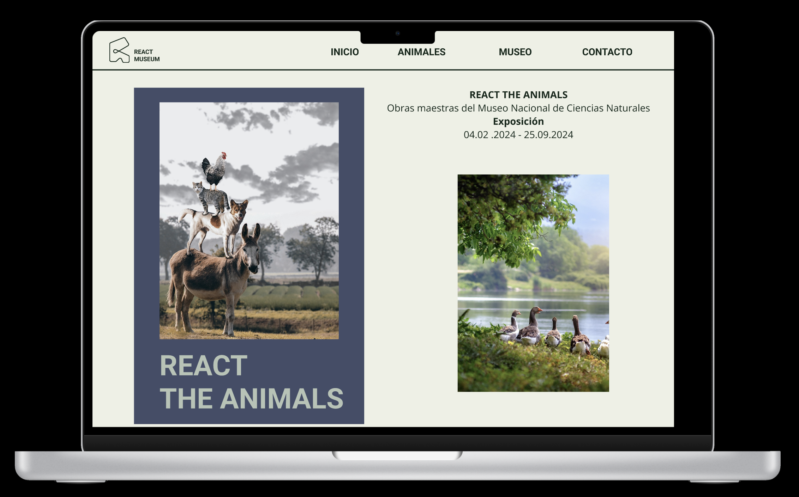
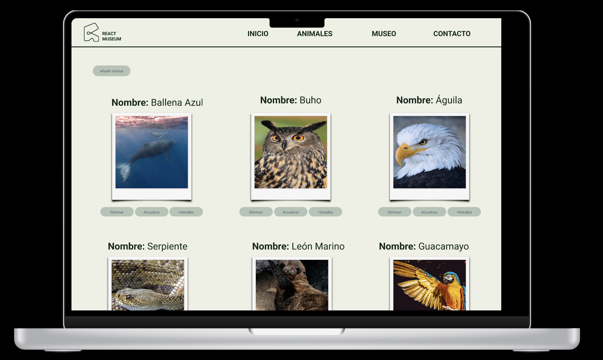

# Museo online "React Museum"

Web para el museo "React", en la que los usuarios pueden navegar sobre esta y en la galería pueden entrar en la exposición de animales y añadir, ver más detalles, modificar o eliminar estos.

## Contenido

- [Descripción](#descripción)
- [Estructura del Proyecto](#estructura-del-proyecto)
- [Cómo Usar](#cómo-usar)
- [Recursos Externos](#recursos-externos)
- [Ejemplos de visionado de la web](#ejemplo-de-visionado-de-la-web)

## Descripción

Este proyecto contiene el código HTML, CSS, JavaScript, React y Test para el sitio web React Museum. La página web tiene las siguientes secciones: Inicio, Animales, Museo y Contacto.

## Estructura

- `index.html`: El archivo principal que renderiza la estructura de la página web.
- `server`: Contiene el archivo db.json donde está nuestra Api que recoge toda la galería de los animales.
- `src`:Carpeta que contiene las imágenes, las páginas, los componentes, el enrutado, los servicios y test de la web.
    - `assets`: carpeta que contiene las imágenes de la web.
    - `components`: Carpeta con los componentes de las páginas de la web.
    - `layout`: Carpeta para introducir la etiqueta outlet, para que todas las otras páginas muestren por defecto la barra de navegación y el footer
    - `pages`: Carpeta con las páginas de la web.
    - `router`: Enrutado de las páginas.
    - `services`: Recoge las llamadas del método CRUD: Get, Delete y Put.
    - `test`: Testeos de los componentes.

## Cómo Usar

1. Clona este repositorio: `git clone` https://github.com/Elianarve/Museum-project.git 
2. Escribe en la terminal el comando `npm install`
3. Escribe en una nueva terminal el comando `npm run api` para inicializar la api.
4. Escribe en una nueva terminal el comando `npm run dev` para inicializar la web.
5. Escribe en una nueva terminal el comando `npm run test` para pasar los test.

## Recursos Externos

- Bootstrap: Se utiliza la versión 5.3.2 de Bootstrap para estilos y componentes. [Sitio web de Bootstrap](https://getbootstrap.com/)
- Google Fonts
- Cloudinary
- Sweet Alert2
- Axios
- json-server
- styled-components
- jsdom
- vitest

## Ejemplo de visionado de la web

 

 